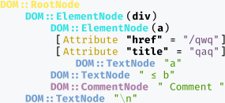

# HTML Parser
The task of Advanced Programming class on 2019/03/28. C++ HTML parser that generates a simple DOM tree.

# Requirements
* C++ compiler with C++17 support
* CMake (>= 3.0)

# Sample
This project contain a sample that read HTML input from a file or stdin, and print the colorized DOM tree to the terminal.

```bash
mkdir build
cd build
cmake -DCMAKE_BUILD_TYPE=Release ../src
make

# Read HTML input from stdin
./html-parser <<< '<div><a href=/qwq title="qaq">a</a> &le; b<!-- Comment --></div>'

# Read HTML input from index.html
./html-parser index.html
```

The output is like (for the first example that reads from stdin):

<pre></pre>

# API
Include `HTMLDocument.h`.

## HTMLDocument
The interface to parse HTML string and get data from it.

### `HTMLDocument::HTMLDocument`
Construct a `HTMLDocument` object from a `std::istream` or string.

```cpp
// explicit HTMLDocument::HTMLDocument(std::istream &)
HTMLDocument document1(std::cin);

// explicit HTMLDocument::HTMLDocument(std::istream &&)
HTMLDocument document2(std::ifstream("index.html"));

// explicit HTMLDocument::HTMLDocument(const StringEx &)
HTMLDocument document3("<div>a &le; b</div>");
```

### `HTMLDocument::parse`
Parse HTML document from a new string, replacing the current if exists.

```cpp
HTMLDocument document(std::cin);

// void HTMLDocument::parse(const StringEx &)
document.parse("<div>a &le; b</div>");
```

### `HTMLDocument::inspect`
Print the colorized DOM tree of HTML document to the terminal.

```cpp
HTMLDocument document("<div>a &le; b</div>");

// void HTMLDocument::inspect()
document.inspect();
```

### `HTMLDocument::getTextContent`
Get all text in the document.

```cpp
HTMLDocument document("<div>a &le; b</div><div>qwq</div>");

// StringEx HTMLDocument::getTextContent()
StringEx textContent = document.getTextContent();
// textContent = "a ≤ bqwq"
```

### `HTMLDocument::getElementById`
Get the element whose `id` attribute equals to a string. Return a `HTMLDocument::Element` object if found, a null `HTMLDocument::Element` object if NOT found.

```cpp
HTMLDocument document("<div id="my-div">a &le; b</div>");

// HTMLDocument::Element HTMLDocument::getElementById(const StringEx &)
HTMLDocument::Element div = document.getElementById("my-div");
```

### `HTMLDocument::getElementsByName`
Get all elements whose `name` attribute equal to a string. Return a `std::vector<HTMLDocument::Element>` that contains all matching elements.

```cpp
HTMLDocument document("<div name="my">a &le; b</div><span name="my">qwq</span>");

// std::vector<HTMLDocument::Element> HTMLDocument::getElementsByName(const StringEx &)
std::vector<HTMLDocument::Element> elements = document.getElementsByName("my");
```

### `HTMLDocument::getElementsByTagName`
Get all elements whose tag name equals to a string. Return a `std::vector<HTMLDocument::Element>` that contains all matching elements.

```cpp
HTMLDocument document("<div>a &le; b</div><div>qwq</div>");

// std::vector<HTMLDocument::Element> HTMLDocument::getElementsByTagName(const StringEx &)
std::vector<HTMLDocument::Element> elements = document.getElementsByTagName("div");
```

### `HTMLDocument::getElementsByClassName`
Get all elements which have a certain class. Return a `std::vector<HTMLDocument::Element>` that contains all matching elements.

```cpp
HTMLDocument document("<div class="my-class">a &le; b</div><div class="my-class">qwq</div>");

// std::vector<HTMLDocument::Element> HTMLDocument::getElementsByClassName(const StringEx &)
std::vector<HTMLDocument::Element> elements = document.getElementsByClassName("my-class");
```

### `HTMLDocument::getTitle`
Get the page title (i.e. text inside the first `<title>` tag) of the document.

```cpp
HTMLDocument document("<title>a &le; b</title>");

// StringEx HTMLDocument::getTitle()
StringEx title = document.getTitle();
// title = "a ≤ b"
```

### `HTMLDocument::getArticleContent`
Get the page's article content (i.e. text inside all `<p>` tags) of the document, separated by `\n`.

```cpp
HTMLDocument document("<p>a &le; b</p><div>QAQ</div><p>qwq</p>");

// StringEx HTMLDocument::getArticleContent()
StringEx content = document.getArticleContent();
// content = "a ≤ bqwq"
```

## HTMLDocument::Element
The interface to get data from a HTML element or its subtree.

The default constructor constructs a empty element, on which you do any operation will result in a `std::invalid_argument` exception. Check it with `if (element)` first.

### `HTMLDocument::Element::inspect`
Print the colorized DOM tree of this element to the terminal.

```cpp
HTMLDocument document("<div id="wrapper"><div>a &le; b</div></div>");
HTMLDocument::Element element = document.getElementById("wrapper");

// void HTMLDocument::Element::inspect()
element.inspect();
```

### `HTMLDocument::Element::getTextContent`
Get all text in the element.

```cpp
HTMLDocument document("<div id="wrapper"><div>a &le; b</div><div>qwq</div></div>");
HTMLDocument::Element element = document.getElementById("wrapper");

// StringEx HTMLDocument::Element::getTextContent()
StringEx textContent = element.getTextContent();
// textContent = "a ≤ b"
```

### `HTMLDocument::Element::getAttribute`
Get a attribute with specfied name of the element. Return a empty string if not found.

```cpp
HTMLDocument document("<div id="wrapper" data-url="/qwq"></div>");
HTMLDocument::Element element = document.getElementById("wrapper");

// StringEx HTMLDocument::Element::getAttribute(const StringEx &)
StringEx value = element.getTextContent("data-url");
// value = "/qwq"
```

### `HTMLDocument::Element::getElementsByTagName`
Get all elements whose tag name equals to a string. Return a `std::vector<HTMLDocument::Element>` that contains all matching elements.

```cpp
HTMLDocument document("<div id="wrapper"><div>a &le; b</div><div>qwq</div></div>");
HTMLDocument::Element element = document.getElementById("wrapper");

// std::vector<HTMLDocument::Element> HTMLDocument::Element::getElementsByTagName(const StringEx &)
std::vector<HTMLDocument::Element> elements = element.getElementsByTagName("div");
```

### `HTMLDocument::Element::getElementsByClassName`
Get all elements which have a certain class. Return a `std::vector<HTMLDocument::Element>` that contains all matching elements.

```cpp
HTMLDocument document("<div id="wrapper"><div class="my-class">a &le; b</div><div class="my-class">qwq</div></div>");
HTMLDocument::Element element = document.getElementById("wrapper");

// std::vector<HTMLDocument::Element> HTMLDocument::Element::getElementsByClassName(const StringEx &)
std::vector<HTMLDocument::Element> elements = element.getElementsByClassName("my-class");
```
